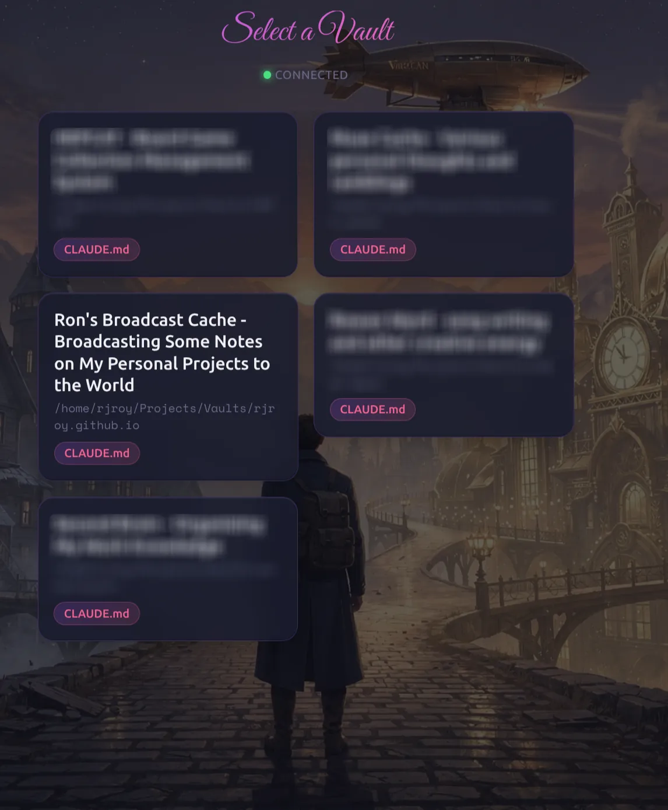
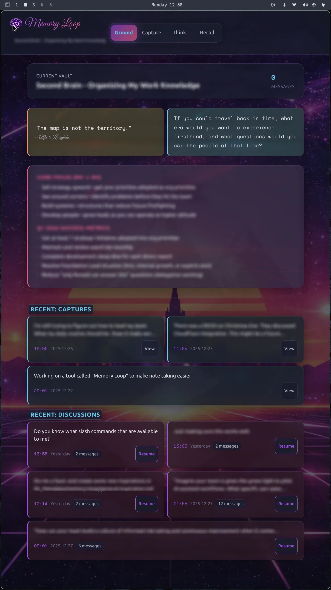
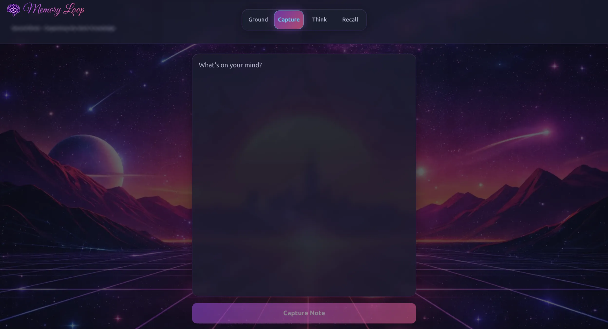
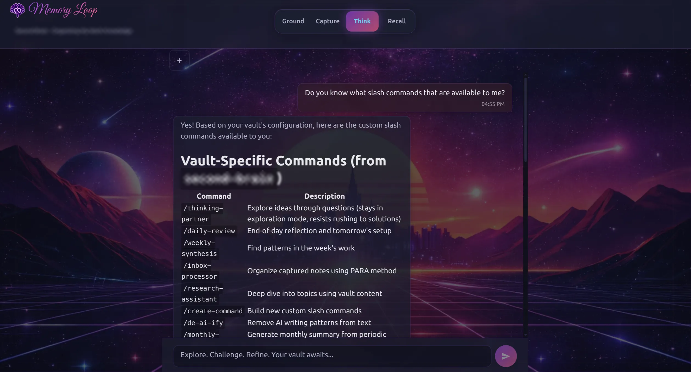

# Memory Loop

Memory Loop is a web application I built to solve a personal friction point: capturing thoughts and consulting my knowledge base from my phone. Obsidian is excellent on desktop, but mobile workflows are clunky—and I wanted Claude AI to have full access to my vault's context.



## The Problem

I use Obsidian as my second brain, organized with the PARA method across multiple vaults—work knowledge, personal projects, hobbies. But when I'm away from my computer and have a thought worth capturing or a question my notes could answer, the friction is too high:

- Obsidian mobile requires navigating folder structures
- No AI assistant has access to my personal knowledge base
- Quick captures interrupt whatever workflow I'm in

I wanted something I could pull up on my phone, type a quick thought, and know it would land in the right place—or ask a question and have an AI that actually knows my context.

## What Memory Loop Does

The interface centers on four modes, each named to evoke the cognitive process:

### Ground

The home dashboard. Shows your current vault's goals (extracted from `CLAUDE.md`, which stores vault-specific context and instructions), AI-generated writing prompts, curated quotes for inspiration, and quick access to recent activity.



### Capture

Minimal friction note capture. Type a thought, tap capture, and it appends to your daily note with a timestamp. Drafts persist across sessions—start a thought on your phone, finish it later.



### Think

AI conversations powered by Claude, with full read access to your vault. Claude can search your files, follow wiki-links, and ground responses in your actual notes. The conversation shows which tools Claude used (expandable), making the AI's reasoning transparent.



### Recall

Browse your vault's file structure directly. Navigate folders, read markdown files, and follow wiki-links. Useful for reviewing what you've captured or finding context for a conversation.


## Architecture

The system runs as a local service on my home network, accessible from any device:

```
┌─────────────────┐     WebSocket      ┌─────────────────┐
│                 │ ◄────────────────► │                 │
│  React Frontend │                    │  Hono Backend   │
│  (Vite)         │                    │  (Bun)          │
│                 │                    │                 │
└─────────────────┘                    └────────┬────────┘
                                                │
                                                │ Claude Agent SDK
                                                ▼
                                       ┌─────────────────┐
                                       │                 │
                                       │  Claude AI      │
                                       │  (via OAuth)    │
                                       │                 │
                                       └────────┬────────┘
                                                │
                                                │ File System Access
                                                ▼
                                       ┌─────────────────┐
                                       │                 │
                                       │  Obsidian       │
                                       │  Vaults         │
                                       │                 │
                                       └─────────────────┘
```

**Frontend**: React 19 with Vite. Touch-friendly UI with 44px+ tap targets, works on screens as small as 320px. The synthwave aesthetic is purely personal preference—it makes the tool feel distinct from my other applications.

**Backend**: Hono server running on Bun. Handles WebSocket connections and manages Claude sessions via the Agent SDK. The backend runs from TypeScript source rather than bundled code because the Claude Agent SDK requires it.

**Shared**: Zod schemas define the WebSocket protocol, ensuring type safety between frontend and backend.

**Claude Integration**: Uses Anthropic's Agent SDK with OAuth authentication through Claude's API. Claude gets file system tools scoped to the selected vault—it can read, search, and navigate but operates within the vault's boundaries.

## Design Decisions

**Multi-vault support**: My knowledge is deliberately partitioned. Work thoughts don't belong in personal projects. Memory Loop lets you switch vaults, and each vault's `CLAUDE.md` gives Claude different context and capabilities.

**WebSocket communication**: Real-time streaming of Claude's responses feels conversational. You see the AI thinking rather than waiting for a complete response.

**Local deployment**: This runs on my home network, not a cloud service. My notes stay on my machines, and Claude accesses them through authenticated API calls—the data never leaves my control.

**Mobile-first design**: Every interaction assumes a thumb on a phone screen. Large tap targets, simple navigation, draft persistence for interrupted sessions.

## Why I Built This

Knowledge management tools often optimize for capture or retrieval, but the interesting space is the loop between them—the moment when a new thought connects to something you wrote months ago, or when reviewing old notes sparks new questions.

Memory Loop is my attempt to keep that loop tight, even when I'm away from my desk. Quick capture reduces the friction of getting thoughts into the system. AI chat grounds conversations in accumulated context. File browsing lets me follow threads when I have time to think.

It's a personal tool solving a personal problem, but the architecture might be useful to others building similar systems.
